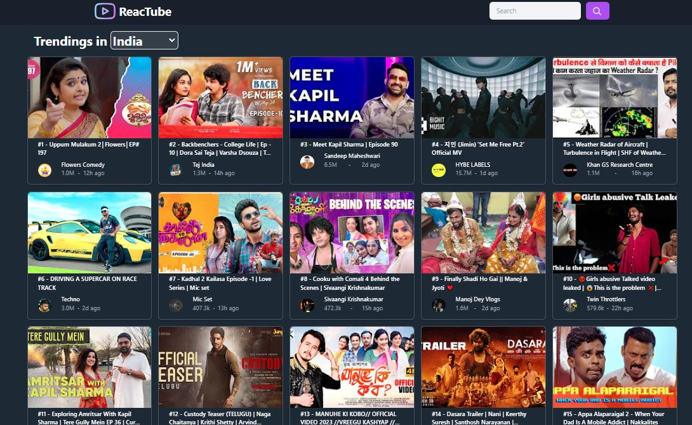
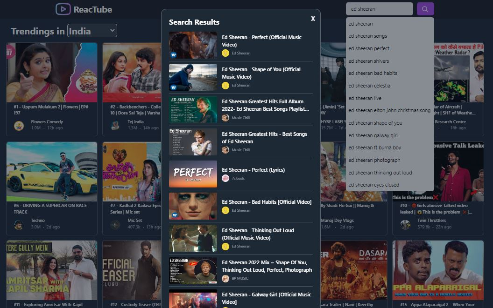
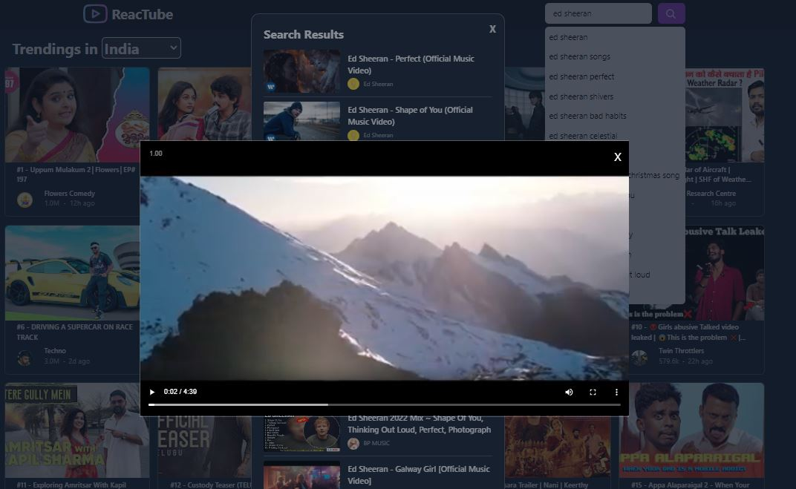

 <h1> ❄️ ReacTube ❄️ </h1>

## Description 🦚
**ReacTube**, is a simple, single page, privacy friendly & distraction free YouTube front-end based on [Piped APIs](https://piped-docs.kavin.rocks/docs/api-documentation/). ReacTube does not contain features like subscriptions, library, registrations etc. It is designed in order to just search and watch and to be focused and particular about what user wants to watch rather than recommendations or handling subscriptions etc.
It  provides a smooth and personalised user experience with features including:

 - **PWA** 
 - **Trendings**  
 - **Search Results** 
 - **Streaming videos** 
 - **Dark Mode** 

## Screenshots 🖼

    
    
    

## ToDo

- [ ] proper components and apply best practices of react
- [ ] code cleanups 
- [ ] manage diff search results such as playlists
- [ ] Countries Dropdown Improve 

## Acknowledgements 🙏
- [Piped](https://github.com/teampiped/piped)
- [Vercel](https://vercel.com/)
